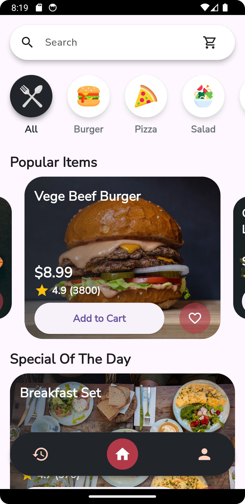
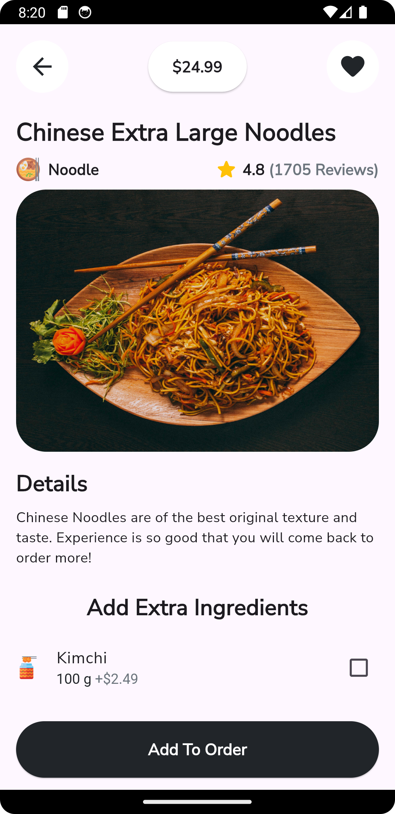
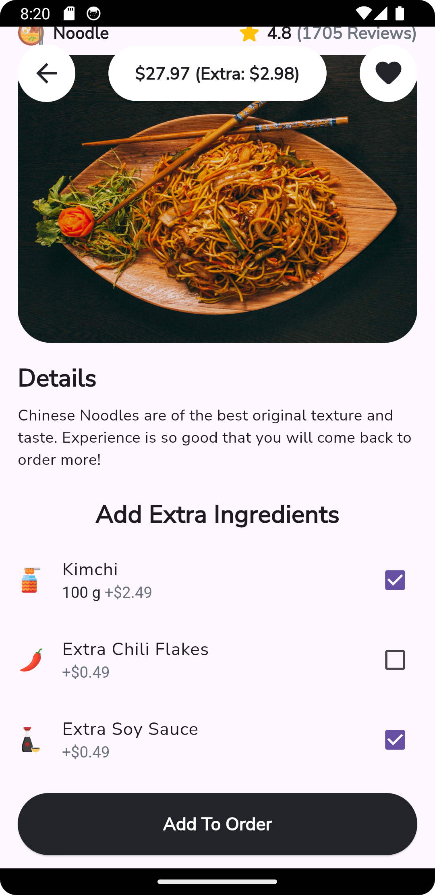
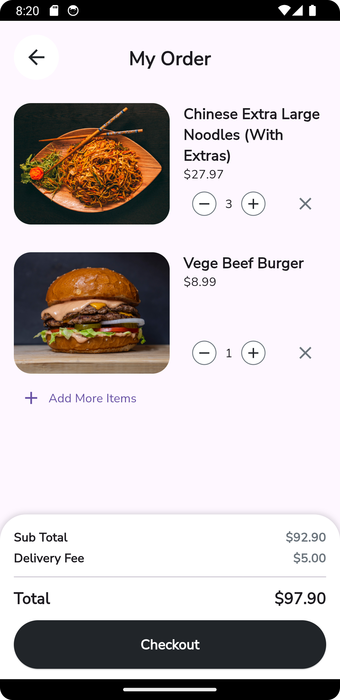
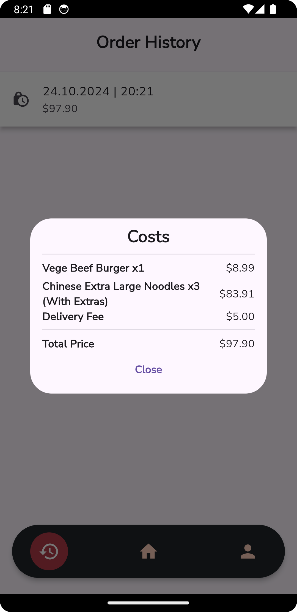
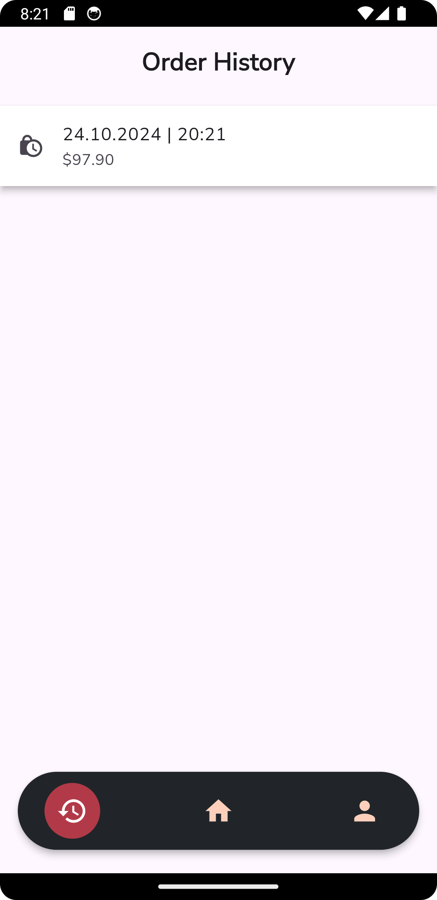

# OrderIn

## Description

**OrderIn** is a small demo app which briefly showcases my skills in Flutter development. The app focuses on food ordering and includes key features that a fully functional app should have.

### Features:
- **Main Screen**: Add a variety of foods to your order with ease.
- **Search Bar**: Quickly find your favorite foods with the built-in search functionality.
- **Filtering Mechanism**: Helps you find any beverage or food you are looking for based on different filters.
- **Order History**: Keep track of all your past orders, helping you relive those memorable meals.
- **Favorites**: Mark items that you love, so you never forget to order them next time.

## Screenshots

App Icon

Main Page

Item Page

Extra Ingredients

Checkout

Order Details

Order History

## Tech Stack

- **Flutter**: Frontend framework for building cross-platform mobile apps.
- **Firebase**: Backend services used for authentication, database, and more.
  - **Firestore**: Cloud-based NoSQL database for storing data.
- **Riverpod**: State management solution for Flutter.
- **Hive**: Lightweight and fast key-value database for local storage.
